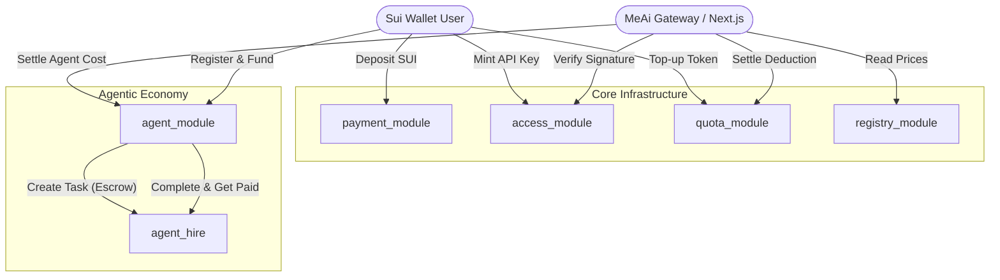

# MeAi Smart Contracts Documentation

Sistem kontrak pintar MeAi (SuiLLM) dibangun menggunakan bahasa **Move** di atas blockchain **Sui**. Arsitektur ini memanfaatkan model berorientasi objek (object-centric) dari Sui untuk menciptakan sistem pembayaran LLM dan ekonomi agen otonom yang aman, terdesentralisasi, dan dapat dikomposisikan.

## 🏗️ Arsitektur Overview

Sistem terdiri dari 6 modul utama yang saling berinteraksi:



---

## 📦 Penjelasan Modul

### 1. `payment_module.move`
Mengelola aliran dana (SUI token) di dalam platform.
- **`Treasury` (Shared Object)**: Menyimpan total deposit dari user yang belum digunakan atau disalurkan.
- **`RevenueConfig`**: Menyimpan konfigurasi persentase pembagian hasil (revenue split) antara penyedia model (LLM providers) dan platform.
- **Fungsi Utama**: `deposit`, `withdraw`, `configure_revenue`, `set_platform_fee`.

### 2. `access_module.move`
Mengubah paradigma API Key tradisional Web2 menjadi NFT (Capability Object) Web3.
- **`ApiCapObject` (Owned Object)**: Bertindak sebagai API Key. Objek ini berisi `tier`, daftar `allowed_models`, dan status aktif.
- **`ApiKeyRegistry`**: Mencatat semua API Key yang pernah diterbitkan.
- **Fungsi Utama**: `mint_cap`, `revoke_cap`, `transfer_cap` (API Key dapat diperjualbelikan atau dipindahtangankan!), `verify_cap`.

### 3. `quota_module.move`
Mengelola saldo token inferensi dan batasan pengeluaran.
- **`QuotaObject`**: Menyimpan `token_balance` (sisa kuota) dan melacak `used_today` berdasarkan epoch.
- **`SpendCapObject`**: Fitur keamanan untuk agen otonom agar pengeluaran harian tidak melebihi `max_spend_per_day` meskipun dompet diretas.
- **Fungsi Utama**: `create_quota`, `topup`, `deduct`, `create_spend_cap`, `update_spend_cap`.

### 4. `registry_module.move`
Katalog model LLM on-chain yang menjadi "single source of truth" untuk harga.
- **`ModelRegistry`**: Menyimpan tabel semua model yang didukung.
- **`ModelInfo`**: Berisi ID model, provider, dan harga per 1.000 token (input & output).
- **Fungsi Utama**: `add_model`, `update_model_pricing`, `calculate_cost`.

### 5. `agent_module.move` (Inti dari Agentic Web)
Memberikan identitas dan otonomi finansial kepada AI Agent.
- **`Agent` (Owned Object)**: Merepresentasikan satu AI Agent. Memiliki `system_prompt`, `allowed_models` (model yang boleh dipanggilnya), serta `daily_budget`.
- **`AgentRegistry`**: Menyimpan total agen terdaftar.
- **Fungsi Utama**: `register_agent`, `fund_agent`, `deduct_agent`, `deactivate_agent`.
> **Kenapa ini penting?** Agen dapat melakukan inferensi mandiri ke Gateway, dan Gateway akan memanggil `deduct_agent`. Jika pengeluaran hari itu melebihi `daily_budget`, transaksi otomatis dibatalkan oleh kontrak.

### 6. `agent_hire.move` (A2A Coordination)
Protokol agar agen dapat menyewa agen lain secara *trustless* (tanpa kepercayaan).
- **`AgentTask`**: Objek *escrow* (rekening bersama). Menyimpan instruksi tugas dan saldo SUI yang ditahan.
- **Status Tugas**: `PENDING`, `ACCEPTED`, `COMPLETED`, `DISPUTED`.
- **Fungsi Utama**: 
  - `create_task`: Agen A membuat tugas dan mengunci SUI.
  - `accept_task`: Agen B menerima tugas.
  - `complete_task`: Tugas selesai, SUI otomatis ditransfer ke Agen B.
  - `dispute_task`: Jika hasil tidak sesuai, masuk ke penyelesaian sengketa.

---

## 🚀 Mengapa Menggunakan Object-Centric Model Sui?

Sui sangat cocok untuk kasus penggunaan AI Agent karena:
1. **Keamanan Tanpa Batas**: API Key (`ApiCapObject`) dan Saldo (`QuotaObject`) adalah objek terpisah yang dimiliki sepenuhnya oleh pengguna.
2. **Kinerja Tinggi**: Penggunaan PTB (Programmable Transaction Blocks) oleh Gateway memungkinkan ratusan operasi pemotongan saldo (`deduct`) disatukan ke dalam satu transaksi jaringan, menghemat biaya *gas* secara drastis.
3. **Komposabilitas Agen**: Objek `Agent` dapat memiliki objek `AgentTask`, memungkinkan ekonomi antar-agen yang kompleks.

---

## 💻 Panduan Developer

### Menjalankan Unit Test
Semua fungsi utama telah di-cover oleh unit testing di file `tests/meai_tests.move`.

```bash
cd contracts
sui move test
```
*Pastikan semua 15 test passing.*

### Build & Deploy ke Testnet
```bash
cd contracts
sui move build
sui client publish --gas-budget 100000000
```
Setelah deploy, jangan lupa mengupdate `PACKAGE_ID`, `API_KEY_REGISTRY_ID`, dan `MODEL_REGISTRY_ID` di file `.env.local` frontend.
